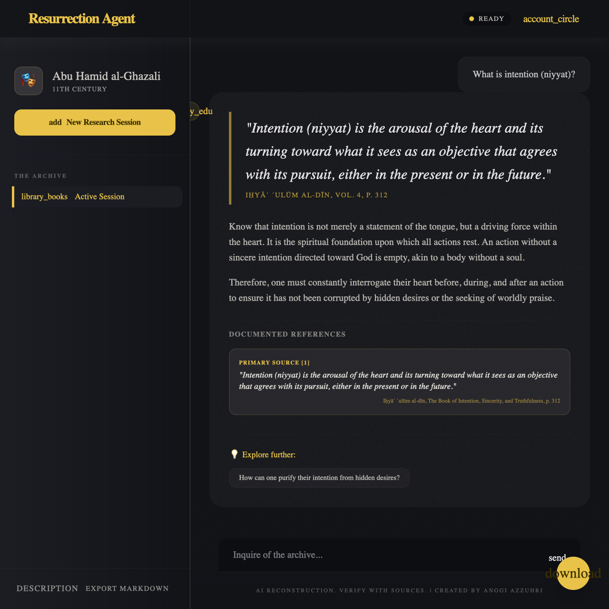

# 🎭 Resurrection Agent

**Converse with historical figures through their documented works.**

A replicable RAG-based framework for creating AI chatbot personas of historical scholars and figures, strictly grounded in their primary source texts. Every response cites specific pages and sources — no hallucination, no fabrication.



**Created by Anggi Azzuhri**

Built with Python · PostgreSQL (pgvector) · OpenRouter (120B/3B) · Voyage AI · FastAPI · Telegram

---

# 📖 For End Users

## What Is This?

The Resurrection Agent allows you to have a conversation with a historical figure — but unlike generic AI chatbots, this one **only speaks from their actual documented works**. Every answer comes with page-level citations so you can verify every claim against the original sources.

This is a **research assistant**, not an entertainment bot. It is designed for academics, students, and researchers studying a particular historical figure.

## How to Use (Web Interface)

1. Open the chatbot URL in your browser
2. You'll see a welcome message from the persona with their greeting
3. Type your question in the input field and press Enter
4. The persona will respond **in their own voice** with citations
5. Click on any citation card to expand and see the direct quote
6. Use the 💡 follow-up suggestions to explore further

### Understanding Citations

Every response includes source citations like:

```
📄 Sources:
  [1] Mekka in the Latter Part of the 19th Century, Ch. Religious Learning, p. 3
      "The Great Mosque serves not only as the center of worship but also as
       the principal institution of learning..."
```

The **page number** refers to the original source text, so you can look it up yourself.

### Session & Export

- Your conversation context is maintained within a session (up to 24 hours)
- Click the ⬇️ **download** button to save your conversation as a `.md` file
- Click the 🔄 **refresh** button to start a new session

## 🚀 Accessing the Agent

The current production instance is the **Al-Ghazali Agent**, specialized in the works of Imam Abu Hamid al-Ghazali (Ihya' Ulum al-Din, Al-Munqidh, etc.).

- **Telegram Bot:** [t.me/ghazali_agent_bot](https://t.me/ghazali_agent_bot)
- **Web Interface:** [https://ghazali.ressurection.ai](https://ghazali.ressurection.ai)

> **Research use only.** This tool is designed to assist scholarly inquiry, not to replace it. Always verify citations.

---

# 🛠️ For Developers

## Architecture Overview

```
┌─────────────────────────────────────────────────────────┐
│                       FRONTENDS                         │
│  ┌──────────────┐     ┌──────────────────────────────┐  │
│  │ Telegram Bot  │     │ Web Interface (React/Next.js)│  │
│  └──────┬───────┘     └──────────────┬───────────────┘  │
│         │                            │                  │
│         └──────────────┬─────────────┘                  │
│                        ▼                                │
│           ┌─────────────────────────┐                   │
│           │      api.py (FastAPI)   │                   │
│           │   (Multi-tenant Logic)  │                   │
│           └────────────┬────────────┘                   │
│                        ▼                                │
│      ┌───────────────────────────────────────────┐      │
│      │        ORCHESTRATION & RAG ENGINE         │      │
│      │  ┌──────────────┐       ┌──────────────┐  │      │
│      │  │ INTENT ROUTER│ ─────▶│ VECTOR STORE │  │      │
│      │  │ (Llama 3B)   │       │ (PostgreSQL) │  │      │
│      │  └──────────────┘       └──────────────┘  │      │
│      │         │                      │          │      │
│      │         ▼                      ▼          │      │
│      │  ┌──────────────┐       ┌──────────────┐  │      │
│      │  │ GENERATOR    │◀──────┤ VERIFIER     │  │      │
│      │  │ (GPT-OSS 120B)│       │ (Llama 3B)   │  │      │
│      │  └──────────────┘       └──────────────┘  │      │
│      └───────────────────────────────────────────┘      │
│                        ▼                                │
│             ┌──────────────────────┐                    │
│             │   PERSONA DEFINITION │                    │
│             │ (persona.json + SP)  │                    │
│             └──────────────────────┘                    │
└─────────────────────────────────────────────────────────┘
```

## Core Differentiators

- **Intent-Based Routing:** Uses a fast 3B model to analyze user intent. Greetings and small talk bypass the RAG pipeline entirely for sub-2s latency.
- **PostgreSQL / HNSW:** Production-ready vector search using `pgvector` with HNSW indices for high-concurrency multi-tenant performance.
- **Language Consistency:** Native detection of Indonesian, Arabic, and English to ensure the persona responds in the user's language without losing technical Arabic terms.
- **Hallucination Verification:** A secondary "Verifier" pass checks every citation and claim for anachronisms or fabrications before the user sees them.

## Quick Start

```bash
# 1. Clone and install
cd "Ressurection Agent"
python3 -m venv .venv
source .venv/bin/activate
pip install -r requirements.txt

# 2. Configure
cp .env.example .env
# Edit .env: add GEMINI_API_KEY (required), optionally ANTHROPIC_API_KEY and TELEGRAM_BOT_TOKEN

# 3. Prepare & Ingest sources [REDACTED FOR PUBLIC REPO]
# The system integrates primary source datasets by chunking and embedding
# the texts into the vector store (PostgreSQL/pgvector) for retrieval.
# <database_commands_censored>

# 5. Start the agent
python main.py                  # Web UI only (http://localhost:8000)
python main.py --telegram       # Web UI + Telegram bot
python main.py --telegram-only  # Telegram only
```

## Creating a New Persona

This is the core replicability feature. To create an agent for a different historical figure:

### Step 1: Edit `persona.json`

```json
{
  "name": "Ibn Khaldun",
  "name_display": "Ibn Khaldun",
  "era": "1332–1406 CE",
  "field": "Historiography, Sociology, Economics",
  "language": "Arabic",
  "bio_summary": "North African polymath, considered the founder of sociology...",
  "major_works": ["Muqaddimah", "Kitab al-Ibar"],
  "communication_style": {
    "tone": "philosophical, analytical, observational",
    "hallmarks": [
      "Grounds arguments in cyclical theory of civilization (asabiyyah)",
      "Draws on extensive historical examples to support theoretical claims",
      "Uses 'It should be known that...' as a characteristic opener"
    ],
    "avoids": [
      "Speculation beyond documented positions",
      "References to events after 1406 CE"
    ]
  },
  "refusal_style": "This matter falls outside the scope of my investigations...",
  "greeting": "In the name of God. I am prepared to discuss matters of history and civilization.",
  "closing": "God knows best.",
  "disclaimer": "AI reconstruction for research purposes."
}
```

### Step 2: Write `research_notes.md`

Add notes from biographers and scholars about the figure's rhetorical style:

```markdown
# Research Notes: Ibn Khaldun

## Communication Style
- Opens chapters with "It should be known that..." (اعلم أن)
- Builds arguments inductively from historical evidence
- Frequently critiques earlier historians for lack of methodology
```

### Step 3: Prepare and Ingest Sources

> **[REDACTED]** *The precise tools and commands for formatting and database ingestion have been hidden in this public documentation.*
> 
> *General Process:* The prepared primary source documents and metadata are ingested into a vector database (PostgreSQL/pgvector) using semantic embeddings. This integrates the dataset with the core model pipeline, creating the foundational knowledge base the LLM searches to generate cited, historically accurate responses.

### Step 4: Run

```bash
python main.py
```

That's it. The entire RAG pipeline, citation engine, and frontends adapt automatically.

## Source File Format

> **[REDACTED]** *The specific schema and formatting rules for the raw data have been hidden.*
> 
> *Integration Summary:* The framework is built to process structured or semi-structured text data. The crucial integration step involves preserving metadata (such as book titles, chapter contexts, and original page numbers) alongside the text. When this dataset is chunked and embedded via Voyage AI into PostgreSQL, the metadata is permanently attached to the semantic vectors, thereby enabling the output model to provide precise, page-level citations in its responses.

## LLM Provider Configuration

The system uses **OpenRouter** as the primary provider to route to specialized models.

| Component | Model | Role |
|-----------|-------|------|
| **Generator** | `openai/gpt-oss-120b` | High-fidelity persona-voiced answer generation |
| **Router** | `meta-llama/llama-3.2-3b-instruct` | Fast intent classification and search string optimization |
| **Verifier** | `meta-llama/llama-3.2-3b-instruct` | Hallucination and anachronism checking |
| **Embedding** | `voyage-4-lite` | High-precision vector embeddings (Voyage AI) |

Set in `.env`:
```
OPENROUTER_API_KEY=your-key
VOYAGE_API_KEY=your-key
VECTOR_STORE_TYPE=postgres
DATABASE_URL=postgresql://...
```

## Project Structure

```
Ressurection Agent/
├── .env.example              # API key template
├── .gitignore
├── README.md                 # This file
├── requirements.txt          # Python dependencies
├── persona.json              # 🎭 Persona definition (EDIT THIS)
├── research_notes.md         # 📝 Biographer insights (EDIT THIS)
│
├── main.py                   # Entry point (web / telegram / both)
├── config.py                 # Environment-based settings
├── system_prompt.py          # Dynamic prompt builder
├── llm_client.py             # Dual LLM client (Claude / Gemini)
├── session_manager.py        # Conversation memory + export
├── data_loader.py            # JSON/TXT source loading
├── chunker.py                # Sentence-aware text splitting
├── vector_store.py           # PostgreSQL + Voyage embeddings
├── txt_to_json.py            # TXT → JSON converter tool
├── api.py                    # FastAPI backend
├── telegram_bot.py           # Telegram bot handlers
├── ingest.py                 # One-time source ingestion
│
├── static/                   # Web chatbot UI
│   ├── index.html
│   ├── style.css
│   └── app.js
│
├── sources/                  # Source files (JSON)
│   ├── raw/                  # Original TXT files (pre-conversion)
│   └── sample.json           # Example data
│
└── postgres/                 # DB schemas and migrations
```

## API Endpoints

| Method | Endpoint | Description |
|--------|---------|-------------|
| `POST` | `/api/chat` | Send a query, get persona-voiced cited response |
| `GET` | `/api/persona` | Get persona display info |
| `GET` | `/api/sources` | Get ingested source statistics |
| `POST` | `/api/export` | Export session as JSON or Markdown |
| `GET` | `/api/health` | Health check |

### Chat Request

```json
POST /api/chat
{
  "query": "What did you observe about religious education in Mecca?",
  "session_id": "abc12345"   // optional, auto-created if omitted
}
```

### Chat Response

```json
{
  "answer_text": "During my stay in Mecca in 1884-1885, I had occasion to observe...",
  "can_answer": true,
  "citations": [
    {
      "book": "Mekka in the Latter Part of the 19th Century",
      "chapter": "Religious Learning in Mekka",
      "page_number": "3",
      "quote": "The Great Mosque serves not only as the center of worship..."
    }
  ],
  "follow_up": "You may also wish to inquire about the Jawi student community...",
  "closing": "I trust these observations may prove of some service.",
  "session_id": "abc12345",
  "persona_name": "C. Snouck Hurgronje"
}
```

## Extending the Framework

### Adding New Source Formats
Edit `data_loader.py` — add a new loader function and register it in the `LOADERS` dict.

### Custom Citation Format
Edit the `_format_response()` function in `telegram_bot.py` and the `appendAssistantMessage()` function in `static/app.js`.

### Multiple Personas
Each persona is isolated by a unique `tenant_id`. To switch or replicate a persona, simply update the `TENANT_ID` in your environment variables and ensure the corresponding sources have been ingested into the PostgreSQL database under that ID.

### Deployment
- **Local**: `python main.py`
- **Docker**: Create a `Dockerfile` with the Python image, copy project files, install requirements, expose port 8000
- **Cloud**: Deploy to any platform supporting Python (Railway, Render, Fly.io, GCP Cloud Run)
- **Telegram-only** (cheapest): `python main.py --telegram-only` on any VPS

## License

This project is licensed under the GNU Affero General Public License v3.0 (AGPLv3) - see the [LICENSE](LICENSE) file for details.

This is a strong copyleft license that ensures anyone who modifies this framework and makes it available over a network (such as a web chatbot or Telegram bot) must also share their modified source code.

*Note: The user-provided source texts and persona configurations used within the framework remain the responsibility of the deployer to ensure proper attribution and rights.*
